# 👋 Hey, I'm Rebbie Afuyaso

<p align="center">
  
</p>

<p align="center">
  <a href="https://github.com/rebbieafuyaso-coder">
    
  </a>


</p>

---

## 🚀 About Me

I'm **Rebbie Afuyaso**, a **Full-Stack Developer, Software Developer, UI Designer, and Graphic Designer** with around **4–5 years of experience** building digital products, applications, APIs, interfaces, and creative experiences.

I enjoy working across the entire development process — from an initial idea and interface design to backend architecture, databases, APIs, deployment, and everything in between.

I believe great software sits at the intersection of:

```text
🎨 Good Design
      +
⚙️ Good Engineering
      +
🧠 Good Problem Solving
      =
🚀 Great Products
```

### What I do

* 💻 Build full-stack web applications
* ⚙️ Design and develop backend systems & APIs
* 🗄️ Work with relational databases
* 🎨 Design modern and responsive user interfaces
* 🖌️ Create graphics and visual experiences
* 🔐 Build authentication and application systems
* ☁️ Work with deployment, infrastructure & web platforms
* 🧩 Turn ideas into functional products
* 🚀 Experiment with new technologies and side projects

---

## 🛠️ Tech Stack

### 💻 Languages

<p>
  
</p>

### ⚡ Frameworks & Runtime

<p>
  
</p>

### 🗄️ Database

<p>
  
</p>

### 🔧 Tools & Platforms

<p>
  
</p>

### 🎨 Design

```text
UI Design
Graphic Design
Visual Design
Responsive Design
Product Thinking
Design → Development
```

---

## 🧠 How I Think About Development

I don't just want to write code that works.

I want to understand:

```text
What problem are we solving?
          ↓
Who are we solving it for?
          ↓
What should the experience feel like?
          ↓
How should the system work?
          ↓
How can we make it reliable?
          ↓
How can we make it better?
```

For me, development isn't just about technology.

It's about **turning ideas into experiences people can actually use.**

---

# 📊 GitHub Analytics

<p align="center">
  
</p>

<br>

<p align="center">
  
</p>

<br>

<p align="center">
  
</p>

<br>

<p align="center">
  
</p>

> 📌 **These statistics are generated automatically using GitHub Actions and updated regularly.**

---

# 🚀 What I Like Building

I'm particularly interested in building:

| Area                   | What I enjoy                                   |
| ---------------------- | ---------------------------------------------- |
| 🌍 Full-Stack Apps     | Complete applications from frontend to backend |
| ⚡ APIs                 | REST APIs, integrations and backend services   |
| 🎨 UI/UX               | Interfaces that look good and feel intuitive   |
| 📊 Dashboards          | Data-driven admin and management systems       |
| 🔐 Authentication      | Secure user and application systems            |
| 🗄️ Databases          | Designing and working with structured data     |
| ☁️ Cloud & Web         | Deployment, infrastructure and web platforms   |
| 🧩 Developer Tools     | Tools that make development easier             |
| 🎯 Product Development | Turning ideas into usable products             |

---

# 📌 Featured Projects

Here are some projects and experiments I'm working on.

> ⭐ Replace these with your actual repositories and strongest projects.

### 🚀 Project One

**A full-stack application built to solve a real-world problem.**

`Laravel` · `PostgreSQL` · `JavaScript`

🔗 **Repository:** `YOUR_PROJECT_URL`

---

### ⚡ Project Two

**A backend/API-driven application focused on performance, scalability and clean architecture.**

`Node.js` · `JavaScript` · `PostgreSQL`

🔗 **Repository:** `YOUR_PROJECT_URL`

---

### 🎨 Project Three

**A design-focused project combining interface design with frontend development.**

`JavaScript` · `UI Design`

🔗 **Repository:** `YOUR_PROJECT_URL`

---

# 🧩 My Developer Journey

```text
        💡 Curiosity
             │
             ▼
        📚 Learning
             │
             ▼
        💻 Building
             │
             ▼
       🐛 Breaking things
             │
             ▼
        🔧 Fixing things
             │
             ▼
       🧠 Understanding
             │
             ▼
        🚀 Building better
             │
             └───────────────┐
                             │
                             ▼
                        🔁 Repeat
```

After several years of development, one thing hasn't changed:

> **I still enjoy building things and figuring out how they work.**

---

# 🧠 Fun Facts

```text
🎨 Designer's brain
        +
💻 Developer's brain
        +
☕ "Just one more feature"
        +
🐛 "Why isn't this working?"
        =
🚀 Another project
```

* 🎨 I enjoy going from **design → interface → code**
* 🧩 I like solving problems that don't have obvious solutions
* 💻 I enjoy understanding what happens behind the interface
* 🔥 I believe software can be both functional and beautiful
* 🛠️ I learn best by building
* 🐛 Bugs are just undocumented features... right?
* ☕ Sometimes "one small change" becomes an entire feature
* 🚀 I'm always interested in learning something new

---

# 🎯 Currently

* 🔭 Building and experimenting with new ideas
* 🌱 Improving my software engineering skills
* 🧠 Exploring better development practices
* 🎨 Combining design thinking with software engineering
* ⚡ Working on projects that challenge me
* 🚀 Looking for interesting problems to solve

---

# 💡 Development Philosophy

> **Build it. Break it. Understand it. Improve it.**

I believe the best developers aren't the people who know every technology.

They're the people who can:

**learn → adapt → solve → build.**

Technology changes.

The ability to solve problems doesn't.

---

# 🤝 Let's Connect

<p align="center">

  <a href="https://github.com/rebbieafuyaso-coder">
    
  </a>

  <a href="YOUR_LINKEDIN_URL">
    
  </a>

  <a href="YOUR_PORTFOLIO_URL">
    
  </a>

  <a href="mailto:YOUR_EMAIL">
    
  </a>

</p>

---

<p align="center">


</p>

<p align="center">
  <b>Thanks for visiting my profile! ⭐</b>
</p>

<p align="center">
  <i>Keep building. Keep learning. Keep creating. 🚀</i>
</p>
